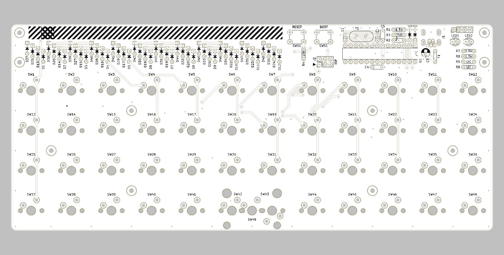

# Plaid // Through hole docs

## Assembly(en)
1. [Check BOM(parts list)](./en/BOM.md)
2. [Solder components, excluding switches](./en/soldering.md)
3. [Bootloader](./en/bootloader.md)
4. [Firmware](./en/firmware.md)
5. [Solder switches and complete](./en/complete.md)

## 組立(日本語)
1. [BOM(パーツリスト)を確認](./jp/BOM.md)
2. [スイッチ以外の部品をはんだづけ](./jp/soldering.md)
3. [ブートローダについて](./jp/bootloader.md)
4. [ファームウェアについて](./jp/firmware.md)
5. [スイッチをはんだづけして完成](./jp/complete.md)

## ALPHA PCB
- [build_guide_rev_alpha_en.md](./alpha/build_guide_rev_alpha_en.md)
- [build_guide_rev_alpha_jp.md](./alpha/build_guide_rev_alpha_jp.md)
  