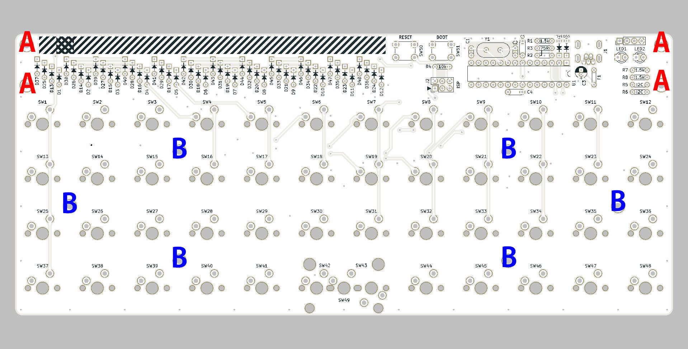
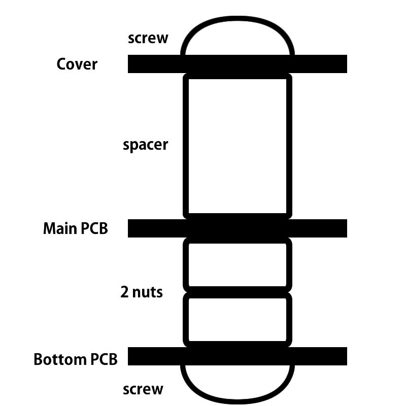
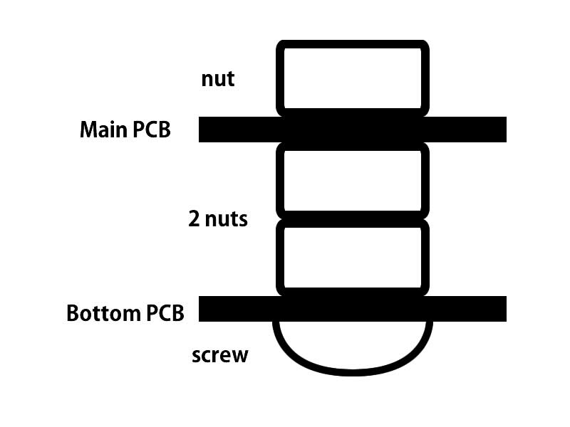
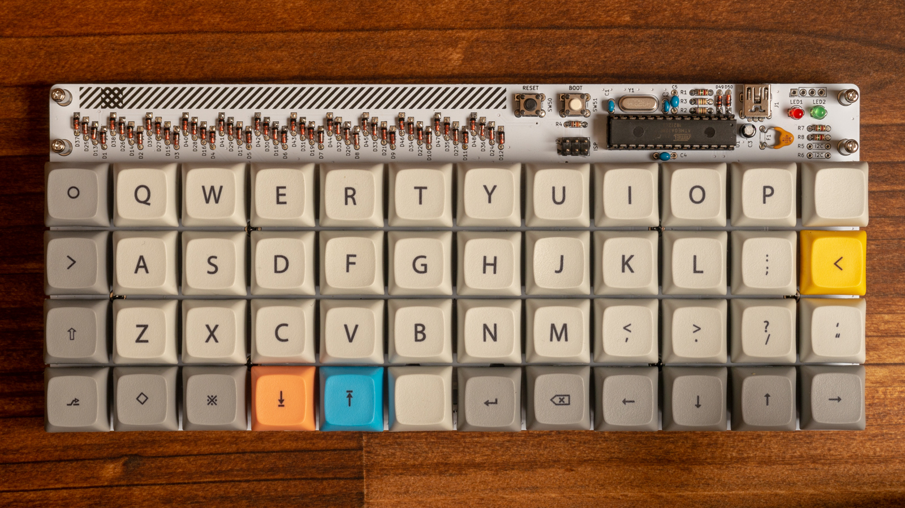

# Soldering switches

Unplug USB cable and solder mx switches.   
You can choose grid or mit layout.
If finish soldering, you should test typing.

# Install bottom PCB and acrylic cover

## A
use screws, nuts, spacers and acrylic cover.

## B
use screws and nuts.

## Install keycaps

## COMPLETE!
