# BOM 
## Plaidキットに含まれているもの
|                                   | Ref         | Qty | Value               | Description                                 |
|-----------------------------------|-------------|-----|---------------------|---------------------------------------------|
| 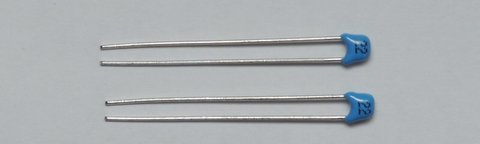 | C1, C2      | 2   | 22p                 | 積層セラミックコンデンサ (2.5mmピッチ) |
| 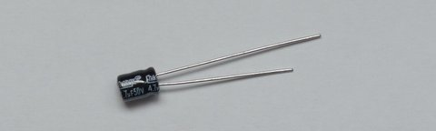              | C3          | 1   | 4.7u                | 電解コンデンサ (1.5mmピッチ)        |
|               | C4, C5      | 2   | 100n                | 積層セラミックコンデンサ(5mmピッチ)   |
| 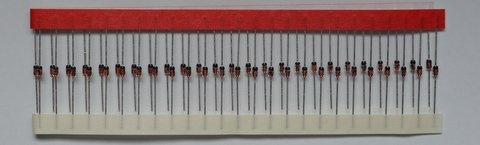              | D1-48       | 48  | 1N4148              | 汎用ダイオード (DO-35)               |
| 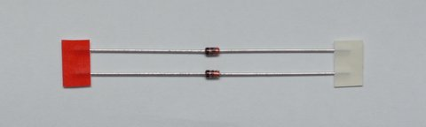              | D49, D50    | 2   | 3.6V                | ツェナーダイオード (DO-35)                 |
|               | F1          | 1   | 100mA               | リセッタブルヒューズ (5mm pitch)                 |
|               | J1          | 1   | USB MINI-B          | USB miniB コネクタ                         |
|               | J2          | 1   | 02x03               | AVR ISP ピンヘッダ                          |
| 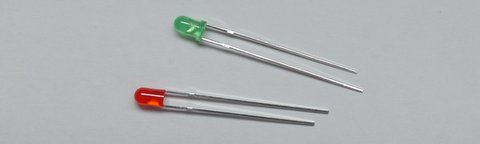              | LED1,2      | 2   | RED, GREEN              | 3mm LED                                     |
| 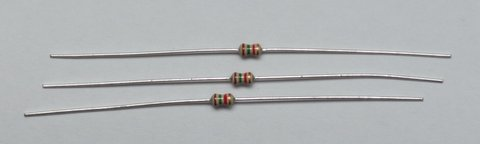              | R1, R7, R8  | 3   | 1.5k                | 1/6W 抵抗                               |
| 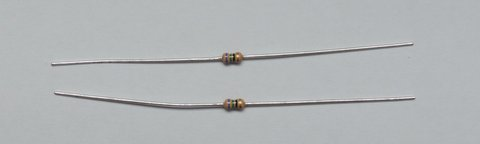              | R2, R3      | 2   | 75R                 | 1/6W 抵抗                               |
| 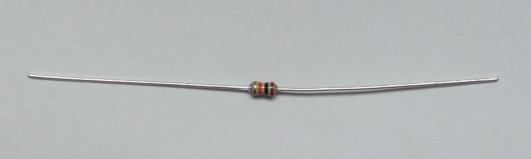              | R4          | 1   | 10k                 | 1/6W 抵抗                               |
| 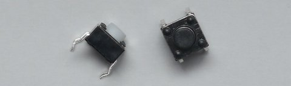              | SW50, SW51     | 2   | RESET, BOOT         | 6mm タクタイルスイッチ                          |
| 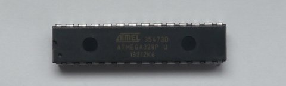              | U1          | 1   | ATMEGA328P          |                                             |
| 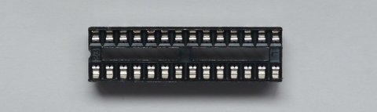              | IC Socket   | 1   | 28pin               | 28pin IC ソケット                             |
|               | Y1          | 1   | 16MHz               | クリスタル                                            |
|                                    | ねじ       | 14  | M2 8mm              |                                             |
|                                    | ナット         | 26  | M2                  |                                             |
|                                    | スペーサー      | 4   | M2 10mm             |                                             |
|                                    | ゴム足 | 4   |                     |                                             |
|                                   | PCB         | 1   | MAIN PCB            |                                             |
|                                   | PCB         | 1   | BOTTOM PCB          |                                             |

## キットに含まれていないもの
- Cherry MX 互換スイッチ * 48   
**PCB mount (5pin) タイプのみ**

- USB miniB ケーブル
