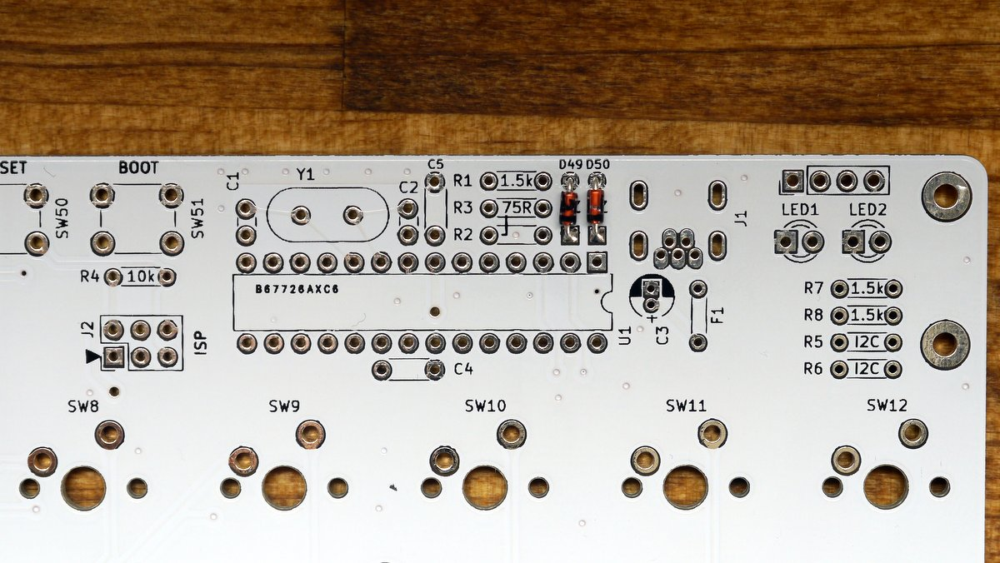
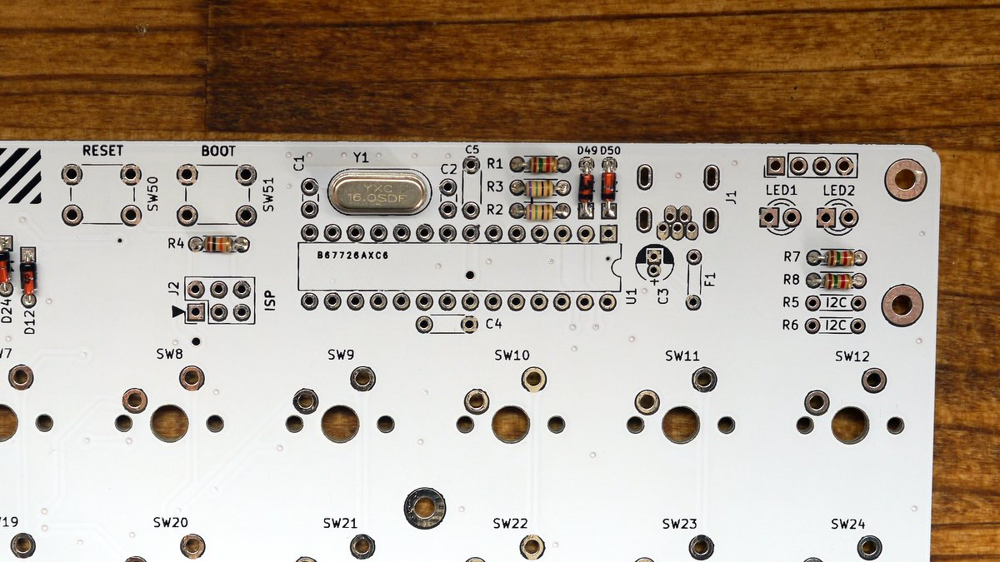
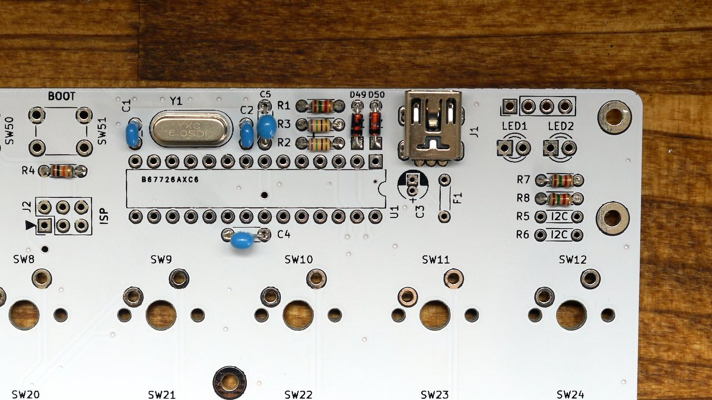
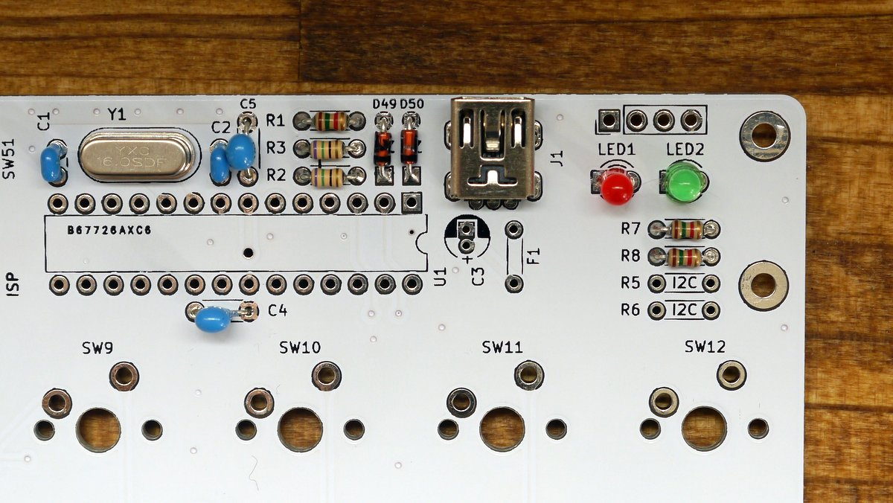
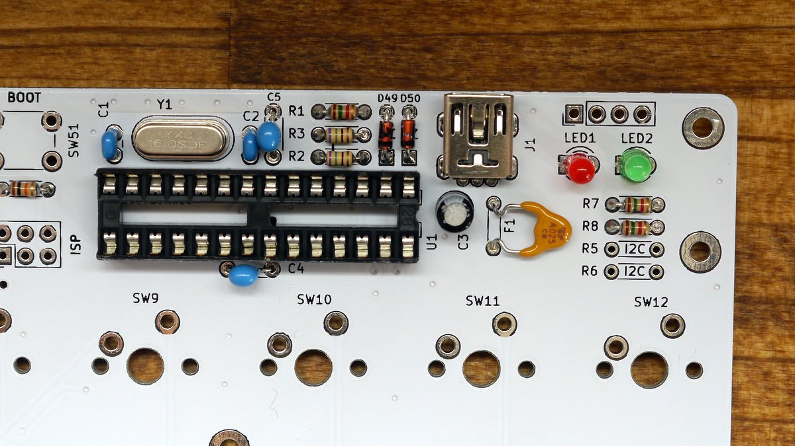

# Assembly

## Before starting assembly
- Check the components are complete. See [BOM](assembly.md). 
- If you are not used to soldering, learn how to solder components.
  - https://learn.adafruit.com/adafruit-guide-excellent-soldering/tools

## Soldering
### Zener diodes (D49,50)

Solder D49 and D50.   
Diode is a `polarized` component and therefore take care of direction.
A Black line on diode is cathode. (square pad on pcb)

### Resistors (R1,2,3,4,7,8)

Solder resistors.
Don't place on R5 and R6. (They are for i2c)

| Ref    | Value | Color code              |
|--------|-------|-------------------------|
| R1,7,8 | 1.5k  | Brown/Green/Red/Gold    |
| R2,3   | 75    | Purple/Green/Black/Gold |
| R4     | 10k   | Brown/Black/Orange/Gold |
| R5,6   | I2C   | Do not place            |

### Diodes 1N4148 (D1-48)

Solder D1-D48.
Diode is a `polarized` component and therefore take care of direction.
A Black line on diode is cathode. (square pad on pcb)

### Crystal

Solder crystal.

### Capacitors (C1,2,4,5)

There are 2 kinds of lead pitch.

| Ref  | Value | Lead pitch |
|------|-------|------------|
| C1,2 | 22pF  | 2.5mm      |
| C4,5 | 0.1uF | 5mm        |

### USB connector

Narrow pitch! Be careful of solder bridge between pins. 

### LEDs

LED is a `polarized` component and therefore take care of direction.
A short leg is cathode. (square pad on pcb)

If you use leds, make bridge J4 and J5 on bottom side.

### IC socket

Solder IC socket.
IC socket is a `polarized` component and therefore take care of direction.
Check the notch on silk and IC Socket.  

### Electrolytic capacitor(C3) and Resettable fuse(F1)

Electrolytic capacitor is a `polarized` component and therefore take care of direction.
A short leg is cathode. (square pad on pcb)

And after soldering resettable fuse, bend like the image. 

### Tactile Switch(SW50,51) and pin header

### ATMEGA328p

Insert ATMEGA328P into IC Socket.

ATMEGA328 is a `polarized` component and therefore take care of direction.
See the image.

## Check list before connect USB
- No short between VCC and GND, USB connector pins.
- Direction of polarized components.(ATMEGA328p, diode, resettable fuse, electrolytic capacitor)
- Resistor value